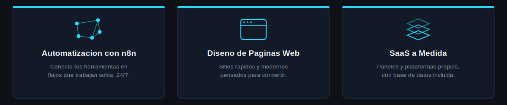

### 🧭 Sobre mí

Ayudo a negocios a dejar de perder tiempo en tareas repetitivas y a tener una presencia digital que sí funciona. Mi trabajo se concentra en tres frentes: **automatizar procesos con n8n e IA**, **diseñar páginas web enfocadas en conversión**, y **construir aplicaciones SaaS a medida** — desde el flujo de datos en el backend hasta la interfaz del usuario final.

Opero bajo **Giovic IA Solutions**, mi marca de consultoría en automatización e IA aplicada.

### 💼 Lo que hago

### 🛠️ Stack y Competencias Técnicas

**IA, Automatización e Integración**
*   
*   
*   
*   
*   

**Frontend, Arquitectura y Desarrollo**
*   
*   
*   
*   
*   
*   

**Infraestructura TI, DevOps y Gestión**
*   
*   
*   
*   
*   
*   
*   
*   

### 📊 GitHub Analytics

  
  

  

### 🚀 Proyectos Destacados

*   **[EncantIA-app](https://github.com/gioviciasolutions1416/EncantIA-app)** — Aplicación web de automatización construida con Next.js + TypeScript. [Ver demo en vivo](https://encant-ia-app.vercel.app)
*   **[Guias_Estudio](https://github.com/gioviciasolutions1416/Guias_Estudio)** — Referencia rápida y guías de comandos para Docker, Git y GitHub.
*   *Nota: Varios de mis proyectos de automatización empresarial (n8n, flujos de datos) y SaaS están protegidos bajo acuerdos de confidencialidad (NDA). Contáctame para compartirte casos de estudio específicos.*

### 🔄 Cómo trabajo

**Diagnóstico** ➡️ **Demo** ➡️ **Estrategia** ➡️ **Delivery**

*Análisis de cuellos de botella ➡️ Prototipo rápido para validar ➡️ Arquitectura y presupuesto ➡️ Despliegue y optimización*

### 📡 ¿Tienes un proceso manual que te quita tiempo? Hablemos.

